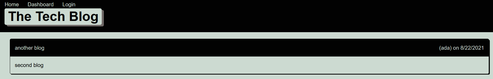

# The Tech Blogs

## Summary  

A CMS-style blog site that allows the user to create blog posts and edit post. User can also delete post as well. The user can comment on post in the mainpage as well.

## Installation

install Node. After install node type the following
npm init
npm install
npm start

## Website

https://pacific-basin-47076.herokuapp.com/

## Tools used

Node, Express, dotenv, squelelize, handlebars, insonima connect-session-sequelize and bcrypt.

## Contributors

Zohaib Ali
